# Snug — Schema UML Reference

> This document is the single source of truth for the Snug database schema.
> Every table, its columns, and all relationships are captured here as ERDs.
> **No changes to `schema.ts` should be made without updating this file first.**

---

## Table of Contents

1. [Full ERD — All Tables](#1-full-erd--all-tables)
2. [sessions](#2-sessions)
3. [organizations](#3-organizations)
4. [widget_configs](#4-widget_configs)
5. [fit_size_charts](#5-fit_size_charts)
6. [garment_mappings](#6-garment_mappings)
7. [usage_logs](#7-usage_logs)
8. [conversion_events](#8-conversion_events)
9. [brand_size_charts](#9-brand_size_charts)
10. [anthropometric_anchors](#10-anthropometric_anchors)
11. [brand_requests](#11-brand_requests)
12. [scrape_runs](#12-scrape_runs)
13. [What scrape_runs and conversion_events actually are](#13-what-scrape_runs-and-conversion_events-actually-are)

---

## 1. Full ERD — All Tables

> Solid lines = foreign key (hard DB constraint). Dashed lines = soft reference (app-level only, no FK).

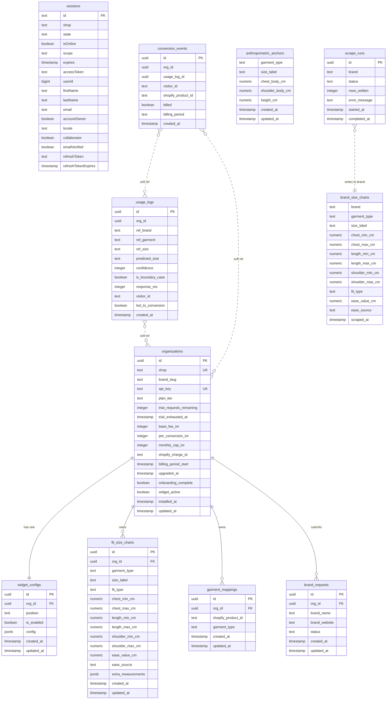

---

## 2. sessions

> **Owner:** Shopify adapter (`@shopify/shopify-app-session-storage-drizzle`). Never write to this directly.

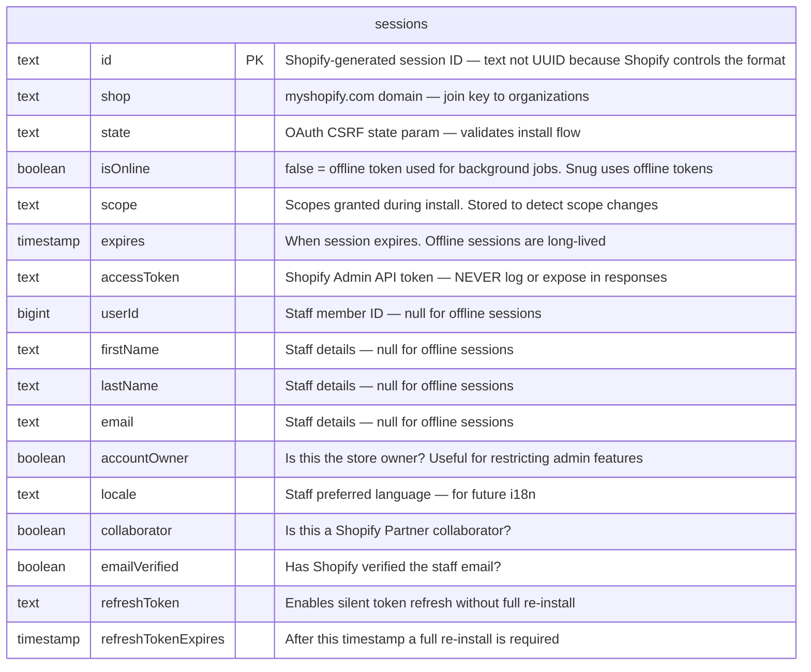

> **Do not touch this table.** The adapter owns the schema contract. Adding, renaming, or retyping any column will break the adapter silently.

---

## 3. organizations

> **Owner:** OAuth callback handler. The root record for every merchant. All other merchant-owned tables hang off this one.

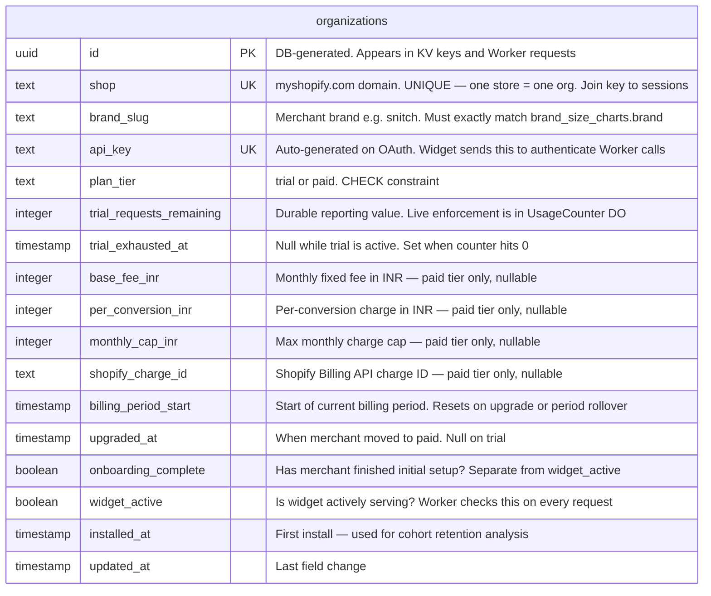

**Key design notes:**
- `trial_requests_remaining` is the **durable reporting value** synced from the `UsageCounter` Durable Object at milestones. Never written on the hot prediction path.
- `onboarding_complete` and `widget_active` are intentionally split. Onboarding = has the merchant done initial setup. Widget active = is the widget currently live. A merchant can complete onboarding and then pause their widget.
- All billing columns (`base_fee_inr`, `per_conversion_inr`, etc.) are nullable — only populated on upgrade to paid.

---

## 4. widget_configs

> **Owner:** Merchant via dashboard. Created automatically with defaults when org is created. One-to-one with organizations.

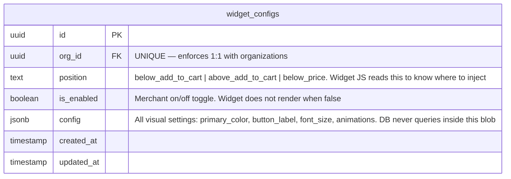

**Rule for what goes in explicit columns vs JSONB:**
If the system (Worker, app routing, widget loader) needs to branch on a value → explicit column.
If only the widget renderer reads it as a whole blob → JSONB. Position and is_enabled go in explicit columns. Button colour goes in JSONB.

---

## 5. fit_size_charts

> **Owner:** Merchant via dashboard. The **target side** of every prediction — the merchant's own sizing data.

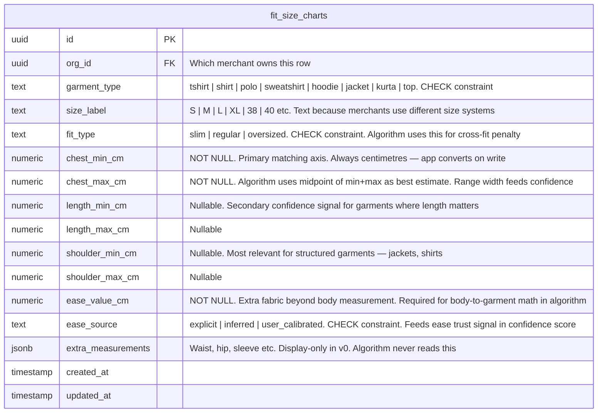

**Unique constraint:** `(org_id, garment_type, size_label)` — prevents duplicate size rows per merchant.

**How it gets to the Worker:** `pushChartToKV()` reads this table and writes `chart:{org_id}:{garment_type}` to Cloudflare KV sorted by chest midpoint. The Worker reads from KV on every prediction — it never queries Postgres on the hot path.

---

## 6. garment_mappings

> **Owner:** Merchant via the product mapping UI in the dashboard. Tells the widget which garment type a Shopify product belongs to.

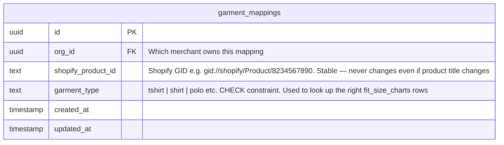

**Unique constraint:** `(org_id, shopify_product_id)` — one product maps to exactly one garment type per merchant.

**How it gets to the Worker:** `pushMappingsToKV()` writes `merchant:{org_id}:mappings` — a JSON object `{ shopify_product_id: { garment_type, is_active } }`. Widget sends the product ID, Worker does KV lookup → gets garment type → fetches chart from KV.

---

## 7. usage_logs

> **Owner:** Cloudflare Worker via `ctx.waitUntil()` — written asynchronously after the prediction response is already sent. **No FK constraints** — Worker uses a restricted DB user with INSERT-only permission on this table.

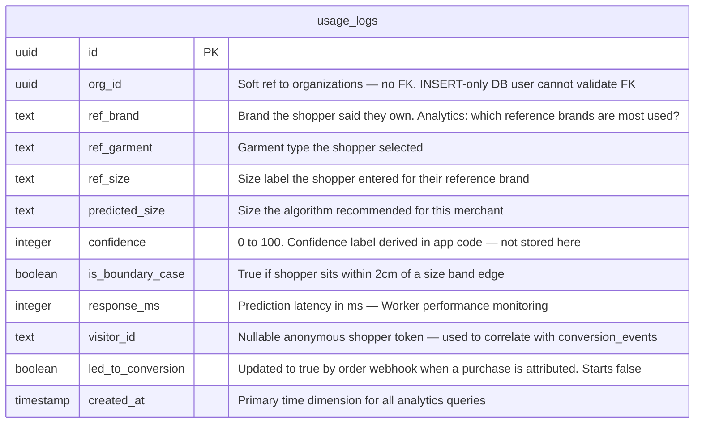

**Indexes:**
- `(org_id, created_at)` — critical for per-org COUNT queries over time ranges in the analytics dashboard.

---

## 8. conversion_events

> **Owner:** Shopify order webhook handler. Written when a shopper who received a size prediction completes a purchase. **No FK constraints** — same restricted-user pattern as usage_logs.

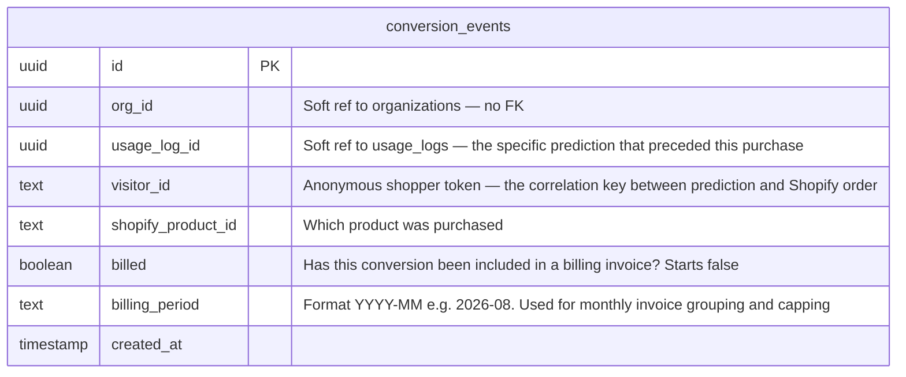

**Indexes:**
- `(org_id, billing_period)` — billing cron: count unbilled conversions per org per month.
- `(visitor_id, shopify_product_id)` — deduplication: prevent double-counting if Shopify fires the webhook twice.

**Billing flow:** Cron reads `billed=false` rows grouped by `billing_period`, calculates `count * per_conversion_inr`, creates Shopify charge, then marks rows `billed=true`.

---

## 9. brand_size_charts

> **Owner:** WebScraper-Snug pipeline. The **reference side** of every prediction. Never written by the Shopify app or the Worker.

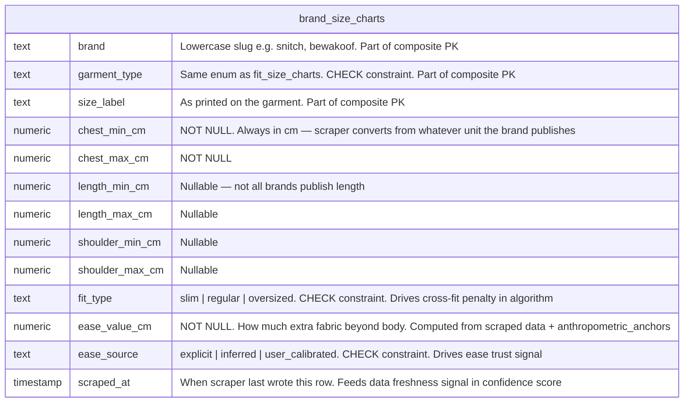

**Composite unique PK:** `(brand, garment_type, size_label)` — scraper uses upsert: re-scraping updates `scraped_at` and measurements, never duplicates.

**No FK to organizations.brand_slug** — scraper-owned table. Soft reference only: app validates `brand_slug` exists here, but DB does not enforce it with a constraint. This prevents a brand rename in the scraper from cascading into merchant records.

**Current scraped brands:**
`snitch` · `overlays` · `bewakoof` · `puma-india` · `rare-rabbit` · `nobero` · `souled-store` · `being-human` · `the-bear-house`

---

## 10. anthropometric_anchors

> **Owner:** Seeded once at DB setup from NIFT (National Institute of Fashion Technology) India survey data. Never updated at runtime.

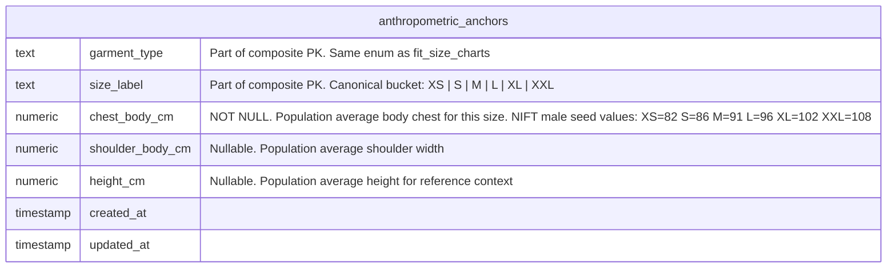

**Composite unique PK:** `(garment_type, size_label)`

**Why it exists:** When the scraper cannot find explicit ease from a brand's website, it infers ease by comparing the scraped garment midpoint against the population average body measurement from this table. Without it the scraper falls back to hardcoded defaults which are less accurate.

**India-specific:** NIFT data reflects the Indian male body, which is the dominant use case for the initial target market. Future female / international rows can be added without schema changes.

---

## 11. brand_requests

> **Owner:** Merchant via dashboard — submitted when their brand is not found in `brand_size_charts` during onboarding.

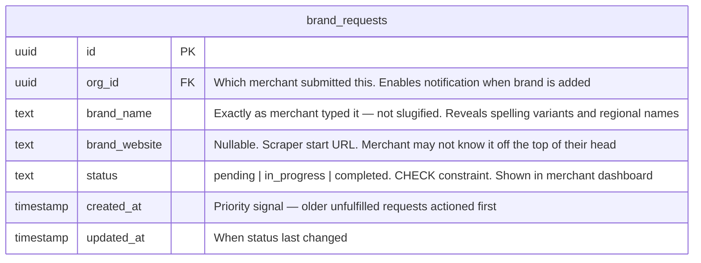

**Purpose:** This is the queue that tells the Snug team which brands to scrape next. Multiple merchants requesting the same brand signals higher priority. When the scraper successfully writes rows for a brand, the status updates to `completed` and the merchant is notified.

---

## 12. scrape_runs

> **Owner:** WebScraper-Snug pipeline. One row per brand per scrape attempt. The operational health log for the scraper system.

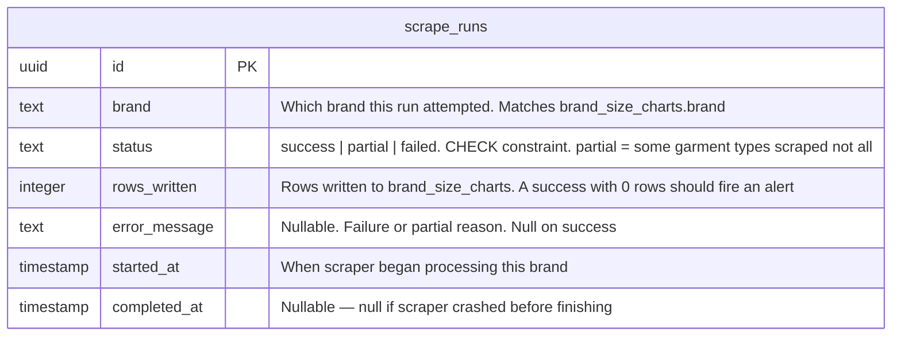

**Why it exists:** Without this table there is no operational visibility into the scraper. Silently failed scrapes only surface when merchants complain about low confidence scores. `scrape_runs` lets the team monitor: which brands are failing, scrape duration trends (brand website slowdowns), and when data was last refreshed.

**Relationship to confidence score:** The confidence signal reads `scraped_at` from `brand_size_charts` rows. `scrape_runs` is the internal audit trail that explains *why* a `scraped_at` might be stale — was it a partial failure? When was the last successful run?

---

## 13. What scrape_runs and conversion_events actually are

### `scrape_runs` — the scraper's operation log

Think of it as a **per-run audit trail for WebScraper-Snug**. Every time the scraper runs for a brand, it writes one row:

```
brand=snitch | status=success | rows_written=24 | started_at=... | completed_at=...
brand=bewakoof | status=partial | rows_written=12 | error_message="hoodie tab not found" | ...
brand=overlays | status=failed | rows_written=0 | error_message="timeout on product page" | ...
```

This is completely invisible to merchants. It is internal operational tooling — it tells the Snug team:
- Is the scraper keeping data fresh?
- Which brands are failing and why?
- How long does each brand take? (useful for detecting site slowdowns)

It connects to the confidence score indirectly: `brand_size_charts.scraped_at` is what the algorithm reads for freshness. `scrape_runs` is what tells you *why* that timestamp might be stale.

---

### `conversion_events` — the purchase attribution table

This answers: **"Did a shopper who used the widget actually buy something?"**

```
Shopper flow:
  1. Lands on product page
  2. Widget fires → POST /v1/size → usage_logs row created { visitor_id: "abc123" }
  3. Shopper adds to cart → buys
  4. Shopify fires order/paid webhook → Shopify app handler
  5. App matches order line items by shopify_product_id + visitor_id cookie
  6. Writes conversion_events row { usage_log_id: ..., visitor_id: "abc123", billed: false }
  7. Sets usage_logs.led_to_conversion = true
```

This table serves two purposes:

**1. Merchant analytics:** "Your widget helped convert X shoppers this month — here is your conversion rate." Without this, the analytics dashboard can only show predictions served, not whether those predictions led to purchases.

**2. Billing on paid tier:** On a `per_conversion_inr` plan, the monthly billing cron:
- Counts `billed=false` rows per `billing_period` per org
- Calculates `count × per_conversion_inr` (capped by `monthly_cap_inr`)
- Creates Shopify billing charge
- Marks those rows `billed=true`

Without `conversion_events`, you cannot prove ROI to merchants and you cannot run a conversion-based billing model.

---

## Relationship Summary

| From | To | Type | Constraint |
|---|---|---|---|
| `sessions` | `organizations` | joined by `shop` domain | app-level (no FK) |
| `organizations` | `widget_configs` | one-to-one | FK + unique index |
| `organizations` | `fit_size_charts` | one-to-many | FK |
| `organizations` | `garment_mappings` | one-to-many | FK |
| `organizations` | `brand_requests` | one-to-many | FK |
| `usage_logs` | `organizations` | many-to-one | **soft — no FK** |
| `conversion_events` | `organizations` | many-to-one | **soft — no FK** |
| `conversion_events` | `usage_logs` | many-to-one | **soft — no FK** |
| `scrape_runs` | `brand_size_charts` | writes to via brand slug | **soft — no FK** |
| `organizations` | `brand_size_charts` | via `brand_slug` field | **soft — no FK** |

**Why `usage_logs` and `conversion_events` have no FKs:**
The Cloudflare Worker and Shopify webhook handler write these tables using a **restricted DB user with INSERT-only permission**. A FK constraint would require the writer to have SELECT on the referenced table to validate the reference — that violates least-privilege. The application layer validates `org_id` values before writing; the DB trusts the writer.
